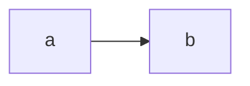

<script setup>
import { data } from '/csv.data.js'
</script>

# Markdown Extension Examples

This page demonstrates some of the built-in markdown extensions provided by VitePress.

## Syntax Highlighting

VitePress provides Syntax Highlighting powered by [Shiki](https://github.com/shikijs/shiki), with additional features like line-highlighting:

**Input**

````md
```js{4}
export default {
  data () {
    return {
      msg: 'Highlighted!'
    }
  }
}
```
````

**Output**

```js{4}
export default {
  data () {
    return {
      msg: 'Highlighted!'
    }
  }
}
```

## Custom Containers

**Input**

```md
::: info
This is an info box.
:::

::: tip
This is a tip.
:::

::: warning
This is a warning.
:::

::: danger
This is a dangerous warning.
:::

::: details
This is a details block.
:::
```

**Output**

::: info
This is an info box.
:::

::: tip
This is a tip.
:::

::: warning
This is a warning.
:::

::: danger
This is a dangerous warning.
:::

::: details
This is a details block.
:::

## Mermaid

```mmd
graph LR
  a --> b
```



## MathJax

```
$$
\begin{align}
\text{Let } \aleph_0 & = \omega \ \omega \\
\text{where } \omega & = \lambda x . x \ x
\end{align}
$$

Let $\aleph_0 = \omega \ \omega$ where $\omega = \lambda x . x \ x$.
```

$$
\begin{align}
\text{Let } \aleph_0 & = \omega \ \omega \\
\text{where } \omega & = \lambda x . x \ x
\end{align}
$$

Let $\aleph_0 = \omega \ \omega$ where $\omega = \lambda x . x \ x$.

## Data & Vue

<template v-for="(csv, index) in data">
  <h3>CSV {{ index + 1 }}</h3>
  <table>
    <tr>
      <th v-for="(value, key) in csv[0]">{{ key }}</th>
    </tr>
    <tr v-for="(row) in csv">
      <td v-for="(value) in row">{{ value }}</td>
    </tr>
  </table>
</template>

## More

Check out the documentation for the [full list of markdown extensions](https://vitepress.dev/guide/markdown).
